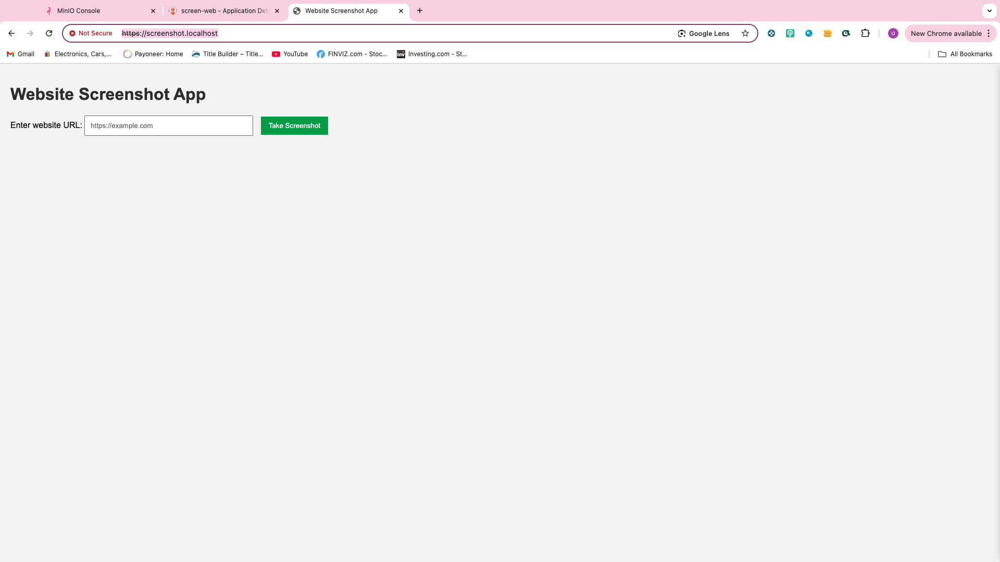
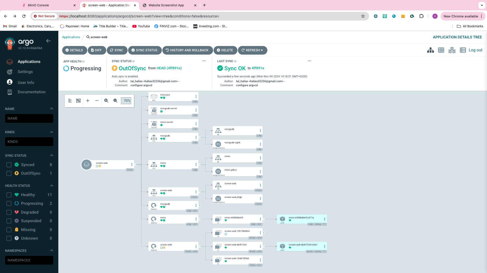
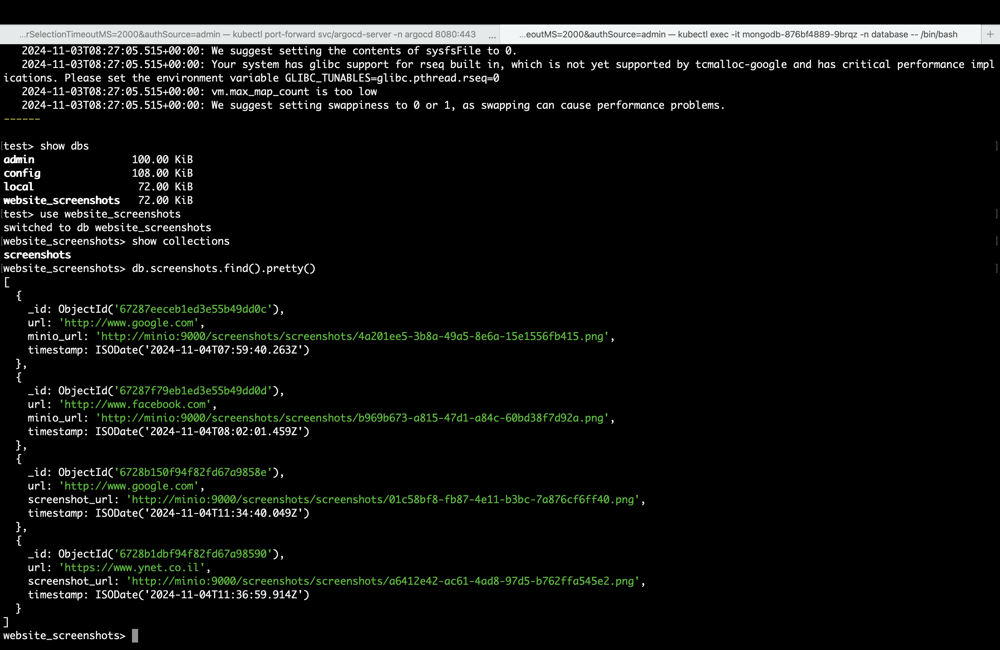

# Screenshot Web Application

A Kubernetes-native web application that captures screenshots of user-specified websites, stores them in MinIO object storage, and maintains metadata in MongoDB. Built with modern DevOps practices including automated CI/CD, monitoring, and secure ingress.

## System Architecture

### Core Components
- **Web Application**: 
  - Flask-based Python service handling screenshot requests
  - Selenium WebDriver for high-quality screenshot capture
  - RESTful endpoints for web interface interaction

- **Object Storage**: 
  - MinIO distributed object storage
  - Scalable bucket architecture for screenshot persistence
  - High-availability configuration

- **Database**: 
  - MongoDB for structured metadata storage
  - Document-based schema for flexible data management
  - Deployed in dedicated namespace for isolation

- **Ingress**: 
  - NGINX Ingress Controller with advanced TLS termination
  - Automated certificate management via cert-manager
  - Secure routing and load balancing

- **CI/CD Pipeline**: 
  - GitHub Actions for automated builds and testing
  - ArgoCD for GitOps-based deployment management
  - Automated rollouts and rollbacks

- **Monitoring Stack**: 
  - Prometheus for metric collection and alerting
  - Grafana for visualization and dashboarding
  - Real-time system metrics and performance monitoring

### Traffic Flow
1. User accesses `https://screenshot.localhost`
2. NGINX Ingress Controller handles TLS termination and routes request
3. Flask application receives the request
4. When a screenshot is requested:
   - Selenium captures the screenshot
   - Image is stored in MinIO
   - Metadata is saved to MongoDB
   - User is redirected to the homepage


### Required Components
- Kubernetes cluster (Docker Desktop K8s, minikube, or cloud provider)
- kubectl CLI tool (v1.20+)
- Helm package manager (v3.0+)
- Docker Engine
- Git

## Installation

1. **Clone the Repository**
```bash
git clone https://github.com/Talh12/screenshot_app.git
cd screenshot-app
```

2. **Deploy Infrastructure Components**
```bash
# Create namespaces
kubectl create namespace database

# Deploy MongoDB
kubectl apply -f K8S/mongodb.yaml

# Deploy MinIO
kubectl apply -f K8S/minio.yaml
```

3. **Setup Ingress and TLS**
```bash
# Add and update NGINX Ingress repository
helm repo add ingress-nginx https://kubernetes.github.io/ingress-nginx
helm repo update

# Install NGINX Ingress Controller
helm install ingress-nginx ingress-nginx/ingress-nginx

# Install cert-manager
kubectl apply -f https://github.com/cert-manager/cert-manager/releases/download/v1.13.2/cert-manager.yaml

# Configure ClusterIssuer
kubectl apply -f K8S/cluster-issuer.yaml

# Apply Ingress rules
kubectl apply -f K8S/ingress.yaml
```

4. **Deploy Application**
```bash
kubectl apply -f K8S/screen_web.yaml
```

5. **Configure CI/CD**
```bash
# Apply ArgoCD configuration
kubectl apply -f argocd.yaml
```

6. **Setup Monitoring**
```bash
# Install Prometheus and Grafana
helm install monitoring prometheus-community/kube-prometheus-stack -n monitoring
```

## Usage

1. Access the application at `https://screenshot.localhost`
2. Enter a website URL in the input field
3. Click "Take Screenshot"
4. The screenshot will be captured and stored in minio bucket 
5. Acess Minio to review the screenshot 


## Monitoring

Access Grafana dashboard:
```bash
kubectl port-forward svc/monitoring-grafana 3000:80 -n monitoring
```
- URL: http://localhost:3000
- Default username: admin
- Get password: 
```bash
kubectl get secret monitoring-grafana -n monitoring -o jsonpath="{.data.admin-password}" | base64 --decode
```

## Deployment Verification






### CI/CD Pipeline
#### Automated Deployment Process

1. Code push to main branch triggers GitHub Actions
2. Automated Docker image building and registry push
3. ArgoCD detection of configuration changes
4. Automated deployment updates in Kubernetes cluster


## Project Structure
```
.
├── App/                    # Application source code
│   ├── Dockerfile         # Container image definition
│   ├── main.py           # Main Python application
│   ├── requirements.txt  # Python dependencies
│   └── templates/        # HTML templates
├── K8S/                   # Kubernetes manifests
│   ├── cluster-issuer.yaml
│   ├── ingress.yaml
│   ├── minio.yaml
│   ├── mongodb.yaml
│   └── screen_web.yaml
└── argocd.yaml           # ArgoCD configuration
```

## Troubleshooting

Common issues and solutions:

1. **504 Gateway Timeout**
   - Check pod logs: `kubectl logs <pod-name>`
   - Verify service endpoints: `kubectl get endpoints`

2. **Image Storage Issues**
   - Verify MinIO credentials
   - Check MinIO pod status

3. **Database Connection Issues**
   - Verify MongoDB credentials
   - Check MongoDB pod status

## Acknowledgments

Thank you for exploring this Screenshot Web Application project. This solution demonstrates modern DevOps practices and cloud-native principles in action. For questions, issues, or contributions, please feel free to open an issue or submit a pull request.

